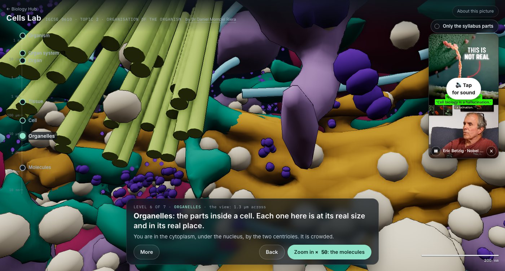
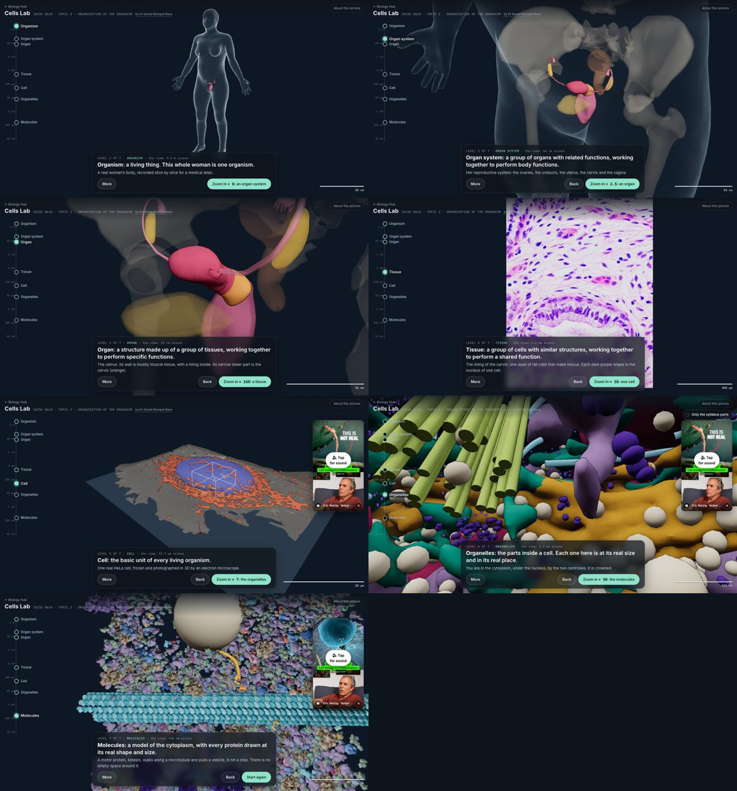

<h1>🔬 &nbsp;Foundations</h1>

**The science everything leans on · Cambridge IGCSE Biology 0610, topics 2–5**

by **Dr Daniel Mompel Riera** · NLCS Jeju

---

## What this is

One shelf of the [Biology Hub](https://nlcsbiology.com/biology-hub/), for the four topics every other topic
leans on. The other shelves move *across* something (a body, a plant, a tree of life); this one moves
*down* into one: a zoom ladder from a whole human to the molecules of one of her cells. The map teaches
Topic 2 by being it, and each topic sits at the level it is about:

| Level | What you see | Topics here |
|---|---|---|
| **Organism** | a real woman's body, from a medical atlas | 2 |
| **Organ system** | her reproductive system | 2 |
| **Organ** | the uterus and its cervix | 2 |
| **Tissue** | two real photographs of the lining of the cervix | 2 |
| **Cell** | one real HeLa cell, imaged in 3D by an electron microscope; Eric Betzig (Nobel Prize in Chemistry 2014) says why the pictures in biology books are wrong | 2 · 3 |
| **Organelles** | inside that cell, every part at its measured size and place: 257,653 ribosomes in one small box | 2 · 3 |
| **Molecules** | a model, labelled as one: real protein shapes in the numbers a HeLa cell holds, and a kinesin walking a microtubule through the crowd | 4 · 5, the Protein & Enzyme Sim |

A size ruler runs from 1 m to 10 nm, with each topic bracketed beside its levels; the caption gives each
level's definition in the words the exam uses, and how many times bigger the next step makes things.
Tap any part to see its name, what it does, and whether the syllabus names it.

## Adding a lab

Edit **`js/topics.js`**: give the topic its `url` and set `status: 'live'`. Then, outside this repository:
its row in `labs-shared/labs.json`, the front door's `js/shelves.js` open list, the labs script's `LABS`,
and the sitemap. Run `node tools/stamp.mjs` here before pushing, so browsers fetch the new files.

<b>Behind the scenes</b> — where every level comes from

 

- **The body and her organs**: the HuBMAP Human Reference Atlas, *United Female* v1.10, made from the
  Visible Human Female of the US National Library of Medicine (CC BY 4.0). Only the parts used were read
  from the atlas's 375 MB file.
- **The tissue**: two micrographs of the endocervix by Mikael Häggström, M.D. (CC0). Their size is
  worked out from the nuclei, because the photographs have no scale bar.
- **The cell and its organelles**: Janelia Research Campus, OpenOrganelle *jrc_hela-2* (CC BY 4.0): a
  HeLa cell frozen under high pressure, set in resin and imaged by focused-ion-beam scanning electron
  microscopy, about 6,400 slices 5 nm apart (Xu et al. 2021), its organelles found by machine learning
  (Heinrich et al. 2021). The camera flies in through a real gap in the data, 64 nm at its narrowest.
- **The molecules**: a model. Protein Data Bank shapes; protein numbers measured in HeLa cells
  (Mueller et al. 2020); 3 million protein molecules per cubic micrometre (Milo 2013). Kinesin takes
  8 nm steps; here it takes one a second instead of about a hundred.
- The picture is drawn with three.js (vendored, no CDN), with ambient occlusion, outlines and haze added
  in one pass, the style of crowded-cell paintings.

`assets/CREDITS.md` lists every source and every change; `tools/model-build/` holds the scripts that made
the files (their downloaded data are not kept here).

## Licence

The software is AGPL-3.0 (`LICENSE`); the teaching material is CC BY-NC-SA 4.0 (`LICENSE-CONTENT`).
Third-party data, pictures and the film keep their own terms: see `NOTICE`.

Something wrong, or a suggestion? Please contact me: dmompelriera@nlcsjeju.kr
